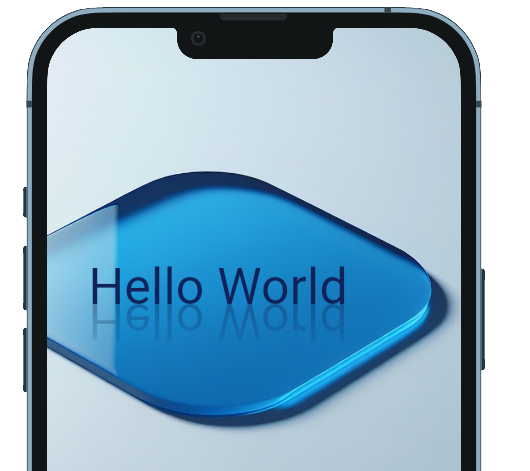

# Reflection Effect
A Flutter widget that reflects the content of a widget. This widget can be used to create mirror effects or to display information in a more visually appealing way.

## Usage

To use the Reflection widget, you first need to import it into your widget file:

```
import 'package:reflection_effect/reflection_effect.dart';
```

Once you have imported the widget, you can use it as follows:

```
Reflection( 
    child: Text('Hello World',
        style: TextStyle(fontSize: 30, color: Colors.blue)),
)
```

You can also change the reflection setting as follows:
```
    Reflection(
        settingReflection: SettingReflection(
            skewX: 0.2,
            scaleY: 0.5,
            opacity: 0.9,
            reflectionLength: 0.4,
            positionX: 0.2,
            expandRight: 10,
            below: -32,
        ),
        child: const Text('Hello World '),
    ),

```


