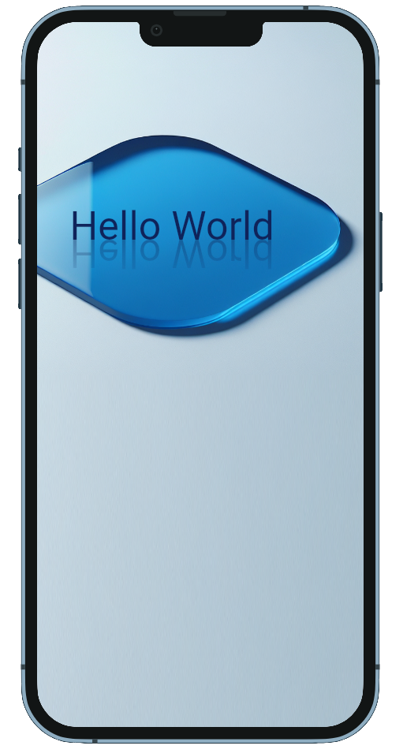

# Reflection
A Flutter widget that reflects the content of a widget. This widget can be used to create mirror effects or to display information in a more visually appealing way.

## Usage

To use the Reflection widget, you first need to import it into your widget file:

```
import 'package:reflection/reflection.dart';
```

Once you have imported the widget, you can use it as follows:

```
Reflection( 
    child: Text('Hello World',
        style: TextStyle(fontSize: 30, color: Colors.blue)),
)
```

You can also change the reflection opacity as follows:
```
Reflection(
    child: Text("This is a reflection"),
    reflectionOpacity: 0.5,
)

```

Sometimes it becomes necessary to create a negative space between the widget and the reflection. This can be done using negative space.

```
Reflection(
    negativeSpace: 20,
    child: Text('Hello World',
        style: TextStyle(fontSize: 30, color: Colors.blue)),
    )
```


